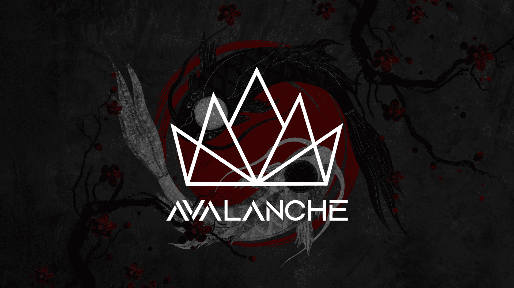

# <b> <i> Project Avalanche</i>

Getting Started:
==============
   
To initialize your local repository, use a command like this:

```bash
     repo init -u https://github.com/AvalancheOS/manifest -b 13
```

Then to sync up:
================

```bash
    repo sync -c -j$(nproc --all) --force-sync --no-clone-bundle --no-tags
```
Compilation of Cherish OS:
====================

From root directory of Project, perform following commands in terminal


```bash
. build/envsetup.sh
 lunch device-codename-userdebug
 mka bacon -j$(nproc --all)
```
 -----------------------------------------------------------------------------
